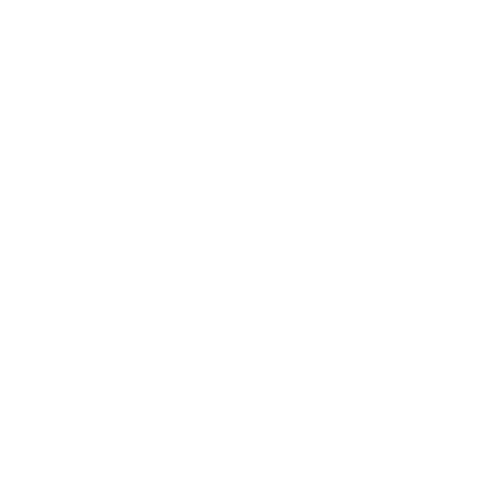
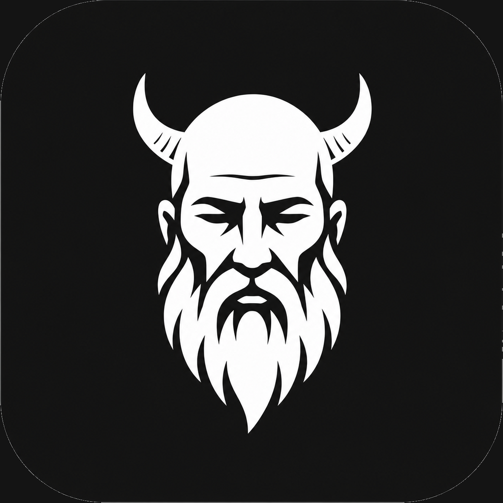
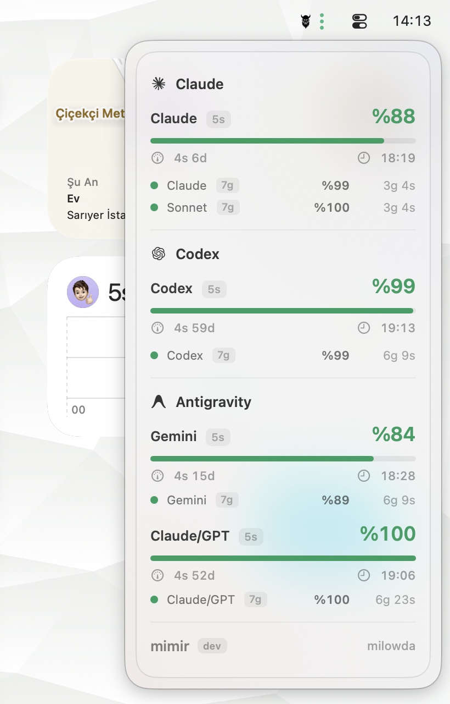
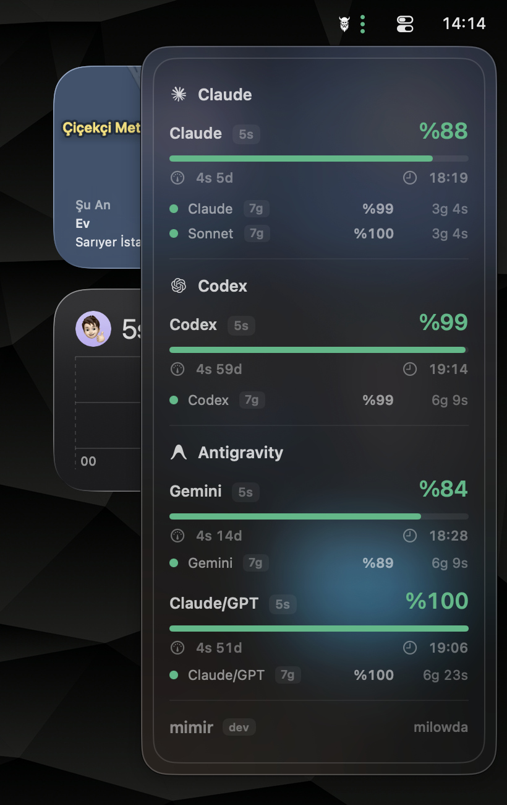

# Mimir

🇬🇧 [English](#english) · 🇹🇷 [Türkçe](#türkçe)



| Light | Dark |
|:---:|:---:|
|  |  |

[](../LICENSE)
[](https://developer.apple.com/macos/)
[](https://swift.org)
[](https://buymeacoffee.com/erayendes)

---

## English

> Track your AI tool usage limits from the macOS menu bar.

Mimir is a lightweight macOS menu bar app that shows real-time usage limits and
reset countdowns for your AI tools — Claude, Codex, Gemini, and Antigravity —
without leaving your workflow.

### Features

- **Menu bar at a glance** — all your AI service statuses in a single popover
- **Live limits** — Claude session limits, Codex credits, and Gemini quotas, updated in real time
- **Reset countdowns** — know exactly when each limit refreshes
- **Color status dots** — green / amber / red based on remaining quota
- **Minimalist design** — monochrome icon, full macOS light/dark mode support
- **Privacy-first** — reads only local app configs and the macOS Keychain; no data ever leaves your machine

### Supported services

| Service | Data source |
|---|---|
| **Claude** | Claude Code OAuth (`~/.claude`) |
| **Codex** | ChatGPT usage API + local JSONL fallback |
| **Antigravity** | Local language server + Cockpit |

### Installation

**Requirements:** macOS 14.0 (Sonoma) or later · Swift 6.0+ (to build from source)

**Download:** Grab the latest `.dmg` from the [Releases](https://github.com/erayendes/mimir/releases)
page, open it, and drag **Mimir.app** to your Applications folder.

**Build from source:**

```bash
git clone https://github.com/erayendes/mimir.git
cd mimir
./script/build_and_run.sh install
```

Full guide → **[Installation](INSTALLATION.md)**

### Reading the menu bar

Mimir's entire UI lives in the menu bar: a small **Mimir glyph** and a vertical **column of colored dots**, one per service with a 5-hour session window (Claude, Codex, Antigravity — Antigravity's dot reflects its most-constrained group). A dot appears only for services with an active reading, so the count matches the LLMs you actually use.

**Dot colors** — based on the remaining percentage in the 5-hour window:

| Color | Remaining | Meaning |
|:---:|---|---|
| 🟢 Green | 50–100% | Plenty left |
| 🟡 Amber | 15–49% | Running low |
| 🔴 Red | below 15% | Near the limit |

**The popover** — click the glyph to open it. Each service is a card with its name and brand icon, the session (5-hour) quota shown prominently with percentage and countdown, a weekly summary row, per-model quota or credit rows, an (i) info icon, and a status note (e.g. *"token expired — open Claude Code"*). Reset times use short units — e.g. `2h 15m`.

**Refreshing & stale state** — Mimir refreshes every minute and on each popover open; if a service hits a rate limit (HTTP 429) it backs off and shows the last-known data. When a live source disappears (e.g. the Antigravity IDE closes), the card is shown **dimmed** with the last snapshot instead of vanishing.

### Documentation

- [Services](SERVICES.md)
- [Privacy & Security](PRIVACY.md)

### Privacy & Security

Mimir never sends any personal data or API keys to remote servers. All data is
fetched locally by reading tool log files (`~/.codex`, `~/.claude`, etc.) and
macOS Keychain entries created by the respective apps.

### Roadmap

> [!NOTE]
> The full roadmap is tracked as GitHub issues — new services, credit tracking,
> Homebrew distribution, and more.
> **[View open issues →](https://github.com/erayendes/mimir/issues)**

### About the name

**Mímir** is a figure from Norse mythology renowned for knowledge and wisdom — the
guardian of the well beneath Yggdrasil from which Odin drank, sacrificing an eye for
insight. After he was beheaded in the Æsir–Vanir war, Odin preserved his head and
kept consulting it for counsel. The name fits the app: a quiet advisor that, at a
single glance, tells you how much you have left and when it resets.

### Contributing

Bug reports and pull requests are welcome. For major changes, please open an
issue first. See [Contributing](CONTRIBUTING.md) · [Support & FAQ](SUPPORT.md) · [Changelog](../CHANGELOG.md).

---

## Türkçe

> AI araçlarınızın kullanım limitlerini macOS menü çubuğundan takip edin.

Mimir; Claude, Codex, Gemini ve Antigravity gibi AI araçlarınızın kullanım
limitlerini ve yenilenme sürelerini iş akışınızı bölmeden macOS menü çubuğundan
anlık olarak gösteren hafif bir uygulamadır.

### Özellikler

- **Menü çubuğunda tek bakış** — tüm AI servislerinizin durumu tek bir popover'da
- **Anlık limitler** — Claude seans limitleri, Codex kredileri ve Gemini kotaları gerçek zamanlı güncellenir
- **Geri sayım** — her limitin tam olarak ne zaman yenileneceğini gösterir
- **Renkli durum noktaları** — kalan kotaya göre yeşil / amber / kırmızı
- **Minimalist tasarım** — monokrom ikon, macOS açık/koyu tema desteği
- **Gizlilik odaklı** — yalnızca yerel uygulama ayarlarını ve macOS Keychain'i okur; hiçbir veri makinenizden çıkmaz

### Desteklenen servisler

| Servis | Veri kaynağı |
|---|---|
| **Claude** | Claude Code OAuth (`~/.claude`) |
| **Codex** | ChatGPT kullanım API'si + yerel JSONL yedeği |
| **Antigravity** | Yerel dil sunucusu + Cockpit |

### Kurulum

**Gereksinimler:** macOS 14.0 (Sonoma) veya üzeri · Swift 6.0+ (kaynaktan derleme için)

**İndirme:** [Releases](https://github.com/erayendes/mimir/releases) sayfasından son
`.dmg` dosyasını indirin, açın ve **Mimir.app**'i Uygulamalar klasörünüze sürükleyin.

**Kaynaktan derleme:**

```bash
git clone https://github.com/erayendes/mimir.git
cd mimir
./script/build_and_run.sh install
```

Ayrıntılı rehber → **[Kurulum](INSTALLATION.md)**

### Menü çubuğunu okuma

Mimir'in tüm arayüzü menü çubuğunda yaşar: küçük bir **Mimir simgesi** ve yanında dikey bir **renkli nokta sütunu** — 5 saatlik seans penceresine sahip her servis için bir nokta (Claude, Codex, Antigravity — Antigravity noktası en kısıtlı grubunu yansıtır). Nokta yalnızca aktif okuması olan servisler için görünür; yani nokta sayısı kullandığınız LLM sayısına eşittir.

**Nokta renkleri** — 5 saatlik penceredeki kalan yüzdeye göre:

| Renk | Kalan | Anlamı |
|:---:|---|---|
| 🟢 Yeşil | %50–100 | Bol hakkınız var |
| 🟡 Amber | %15–49 | Azalıyor |
| 🔴 Kırmızı | %15'in altı | Limite yakın |

**Açılır pencere (popover)** — simgeye tıklayınca açılır. Her servis bir karttır: ad ve marka ikonu, belirgin gösterilen seans (5 saatlik) kotası (yüzde + geri sayım), haftalık özet satırı, per-model kota veya kredi satırları, (i) bilgi simgesi ve bir durum notu (örn. *"token süresi doldu — Claude Code'u aç"*). Yenilenme süreleri kısa birimlerle: örn. `2s 15d`.

**Yenileme & eski veri** — Mimir dakikada bir ve her popover açılışında yeniler; bir servis hız sınırına (HTTP 429) takılırsa geri çekilir ve son bilinen veriyi gösterir. Canlı kaynak kaybolduğunda (ör. Antigravity IDE'si kapanınca) kart yok olmaz, **soluk** (dimmed) hâlde son anlık görüntüyle kalır.

### Dokümantasyon

- [Servisler](SERVICES.md)
- [Gizlilik ve Güvenlik](PRIVACY.md)

### Gizlilik ve Güvenlik

Mimir, kişisel verilerinizi veya API anahtarlarınızı hiçbir zaman uzak sunuculara
göndermez. Tüm veriler yerel olarak araç log dosyaları (`~/.codex`, `~/.claude` vb.)
ve ilgili uygulamaların oluşturduğu macOS Keychain kayıtları okunarak elde edilir.

### Yol Haritası

> [!NOTE]
> Yol haritasının tamamı GitHub issue'ları olarak takip ediliyor — yeni servisler,
> kredi takibi, Homebrew dağıtımı ve daha fazlası.
> **[Açık issue'ları görüntüle →](https://github.com/erayendes/mimir/issues)**

### Meraklısına: İsmin hikâyesi

**Mímir**, İskandinav mitolojisinde bilgelik ve bilgiyle anılan bir figürdür —
Yggdrasil'in kökündeki bilgelik kuyusunun bekçisidir; Odin o kuyudan içip kavrayış
kazanmak için bir gözünü feda eder. Æsir–Vanir savaşında başı kesildikten sonra Odin
başını saklayıp akıl danışmak için ona başvurmaya devam eder. İsim uygulamayla
örtüşüyor: tek bakışta ne kadar hakkınız kaldığını ve ne zaman yenileneceğini söyleyen
sessiz bir danışman.

### Katkıda Bulunma

Hata raporları ve pull request'ler memnuniyetle karşılanır. Büyük değişiklikler için
önce bir issue açın. Bkz. [Katkı](CONTRIBUTING.md) · [Destek & SSS](SUPPORT.md) · [Sürüm Notları](../CHANGELOG.md).

---

[MIT](../LICENSE) © Eray Endes
