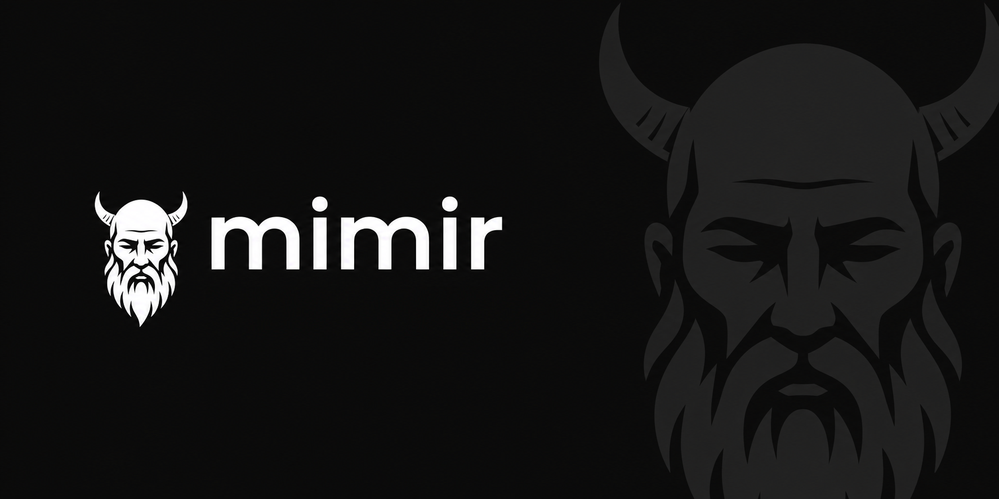

# Mimir

🇬🇧 [English](#english) · 🇹🇷 [Türkçe](#türkçe)



[](../LICENSE)
[](https://developer.apple.com/macos/)
[](https://swift.org)
[](https://buymeacoffee.com/erayendes)


---

## English

> Track your AI tool usage limits from the macOS menu bar.

Mimir is a lightweight macOS menu bar app that shows real-time usage limits and
reset countdowns for your AI tools — Claude, Codex and Antigravity (which covers
Gemini, Claude and GPT) — without leaving your workflow.

### Features

- **Menu bar at a glance** — all your AI service statuses in a single popover
- **Live limits** — session and weekly quotas, per-model rows and credit balances, updated in real time
- **Desktop widgets** — Small and Medium widgets that track the popover
- **Reset countdowns** — know exactly when each limit refreshes
- **Color status dots** — green / amber / red based on remaining quota
- **Minimalist design** — monochrome icon, full macOS light/dark mode support
- **No backend** — Mimir talks only to each provider's own endpoint, with that provider's own token; your quota figures and tokens go nowhere else

### Supported services

| Service | Data source |
|---|---|
| **Claude** | Claude desktop app session, or Claude Code OAuth (`~/.claude`) |
| **Codex** | ChatGPT usage API + local JSONL fallback |
| **Antigravity** | Local language server + Cockpit (Gemini and Claude/GPT groups) |

### Installation

**Requirements:** macOS 14.0 (Sonoma) or later · Swift 6.0+ (to build from source)

**Download:** Grab the latest `Mimir.zip` from the [Releases](https://github.com/erayendes/mimir/releases)
page, unzip it, and drag **Mimir.app** to your Applications folder.

**Build from source:**

```bash
git clone https://github.com/erayendes/mimir.git
cd mimir
./script/build_and_run.sh install
```

Full guide → **[Installation](INSTALLATION.md)**

### Reading the menu bar

Mimir's entire UI lives in the menu bar: a small **Mimir glyph** and a vertical **column of colored dots**, one per service (Claude, Codex, Antigravity — Antigravity's dot reflects its most-constrained group). Each dot follows that service's session window, falling back to its weekly quota when there is no session window — which is the case for Codex since OpenAI removed its 5-hour limit. OpenAI has announced the 5-hour window returns for Plus accounts; when it does, Codex's dot follows it again automatically. A dot appears only for services with an active reading, so the count matches the LLMs you actually use.

**Dot colors** — based on the remaining percentage in the window the dot is tracking:

| Color | Remaining | Meaning |
|:---:|---|---|
| 🟢 Green | 50–100% | Plenty left |
| 🟡 Amber | 15–49% | Running low |
| 🔴 Red | below 15% | Near the limit |

**The popover** — click the glyph to open it. Each service is a card with its name and brand icon, the session (5-hour) quota shown prominently with percentage and countdown, a weekly summary row, per-model quota or credit rows, an (i) info icon, and a status note (e.g. *"token expired — open Claude Code"*). When a service has no session window, the weekly reading is promoted into that spot instead. Reset times use short units — e.g. `2h 15m`.

**Refreshing & stale state** — Mimir refreshes every minute and on each popover open; if a service hits a rate limit (HTTP 429) it backs off and shows the last-known data. When a live source disappears (e.g. the Antigravity IDE closes), the card is shown **dimmed** with the last snapshot instead of vanishing. If it stays unreachable long enough, a notice appears at the top of the popover; dismiss it with the **×** in its corner and that service's dots leave the menu bar with it. Both return once the service reports data again, so a later outage is still announced.

### Documentation

- [Services](SERVICES.md)
- [Privacy & Security](PRIVACY.md)

### Privacy & Security

Mimir has no backend. Tokens are read from the files and macOS Keychain entries your
tools already created (`~/.codex`, `~/.claude`, the Claude desktop app's session), and
used only against each provider's own usage endpoint — the same request the tool itself
would make. Your quota figures and tokens are never sent anywhere else.

Released builds do send crash reports (Sentry) and anonymous, categorical usage signals
(TelemetryDeck, opt-out from the popover menu). Neither receives quota values or tokens.

Full detail → **[Privacy & Security](PRIVACY.md)**

### Roadmap

> [!NOTE]
> The full roadmap is tracked as GitHub issues — new services, credit tracking,
> Homebrew distribution, and more.
> **[View open issues →](https://github.com/erayendes/mimir/issues)**

### About the name

**Mímir** is a figure from Norse mythology renowned for knowledge and wisdom — the
guardian of the well beneath Yggdrasil from which Odin drank, sacrificing an eye for
insight. After he was beheaded in the Æsir–Vanir war, Odin preserved his head and
kept consulting it for counsel. The name fits the app: a quiet advisor that, at a
single glance, tells you how much you have left and when it resets.

### Contributing

Bug reports and pull requests are welcome. For major changes, please open an
issue first. See [Contributing](../.github/CONTRIBUTING.md) · [Support & FAQ](../.github/SUPPORT.md) · [Changelog](CHANGELOG.md).

---

## Türkçe

> AI araçlarınızın kullanım limitlerini macOS menü çubuğundan takip edin.

Mimir; Claude, Codex ve Antigravity (Gemini, Claude ve GPT gruplarını kapsar) gibi
AI araçlarınızın kullanım limitlerini ve yenilenme sürelerini iş akışınızı bölmeden macOS menü çubuğundan
anlık olarak gösteren hafif bir uygulamadır.

### Özellikler

- **Menü çubuğunda tek bakış** — tüm AI servislerinizin durumu tek bir popover'da
- **Anlık limitler** — seans ve haftalık kotalar, model bazlı satırlar ve kredi bakiyeleri gerçek zamanlı güncellenir
- **Masaüstü widget'ları** — popover'ı takip eden Small ve Medium boyutlar
- **Geri sayım** — her limitin tam olarak ne zaman yenileneceğini gösterir
- **Renkli durum noktaları** — kalan kotaya göre yeşil / amber / kırmızı
- **Minimalist tasarım** — monokrom ikon, macOS açık/koyu tema desteği
- **Arka uç yok** — Mimir yalnızca her sağlayıcının kendi uç noktasına, o sağlayıcının kendi token'ıyla bağlanır; kota bilgileriniz ve token'larınız başka hiçbir yere gitmez

### Desteklenen servisler

| Servis | Veri kaynağı |
|---|---|
| **Claude** | Claude masaüstü uygulaması oturumu veya Claude Code OAuth (`~/.claude`) |
| **Codex** | ChatGPT kullanım API'si + yerel JSONL yedeği |
| **Antigravity** | Yerel dil sunucusu + Cockpit (Gemini ve Claude/GPT grupları) |

### Kurulum

**Gereksinimler:** macOS 14.0 (Sonoma) veya üzeri · Swift 6.0+ (kaynaktan derleme için)

**İndirme:** [Releases](https://github.com/erayendes/mimir/releases) sayfasından son
`Mimir.zip` dosyasını indirin, arşivi açın ve **Mimir.app**'i Uygulamalar klasörünüze sürükleyin.

**Kaynaktan derleme:**

```bash
git clone https://github.com/erayendes/mimir.git
cd mimir
./script/build_and_run.sh install
```

Ayrıntılı rehber → **[Kurulum](INSTALLATION.md)**

### Menü çubuğunu okuma

Mimir'in tüm arayüzü menü çubuğunda yaşar: küçük bir **Mimir simgesi** ve yanında dikey bir **renkli nokta sütunu** — her servis için bir nokta (Claude, Codex, Antigravity — Antigravity noktası en kısıtlı grubunu yansıtır). Her nokta o servisin seans penceresini izler; seans penceresi yoksa haftalık kotaya düşer — OpenAI 5 saatlik limiti kaldırdığından beri Codex'te durum budur. OpenAI 5 saatlik pencereyi Plus hesaplar için geri getireceğini duyurdu; geldiğinde Codex noktası yeniden onu izleyecek. Nokta yalnızca aktif okuması olan servisler için görünür; yani nokta sayısı kullandığınız LLM sayısına eşittir.

**Nokta renkleri** — noktanın izlediği penceredeki kalan yüzdeye göre:

| Renk | Kalan | Anlamı |
|:---:|---|---|
| 🟢 Yeşil | %50–100 | Bol hakkınız var |
| 🟡 Amber | %15–49 | Azalıyor |
| 🔴 Kırmızı | %15'in altı | Limite yakın |

**Açılır pencere (popover)** — simgeye tıklayınca açılır. Her servis bir karttır: ad ve marka ikonu, belirgin gösterilen seans (5 saatlik) kotası (yüzde + geri sayım), haftalık özet satırı, per-model kota veya kredi satırları, (i) bilgi simgesi ve bir durum notu (örn. *"token süresi doldu — Claude Code'u aç"*). Bir servisin seans penceresi yoksa haftalık okuma o alana terfi eder. Yenilenme süreleri kısa birimlerle: örn. `2s 15d`.

**Yenileme & eski veri** — Mimir dakikada bir ve her popover açılışında yeniler; bir servis hız sınırına (HTTP 429) takılırsa geri çekilir ve son bilinen veriyi gösterir. Canlı kaynak kaybolduğunda (ör. Antigravity IDE'si kapanınca) kart yok olmaz, **soluk** (dimmed) hâlde son anlık görüntüyle kalır. Yeterince uzun süre ulaşılamazsa popover'ın üstünde bir uyarı belirir; köşesindeki **×** ile kapattığınızda o servisin noktaları da menü çubuğundan gider. Servis tekrar veri verince ikisi de geri gelir, böylece sonraki bir kesinti yine bildirilir.

### Dokümantasyon

- [Servisler](SERVICES.md)
- [Gizlilik ve Güvenlik](PRIVACY.md)

### Gizlilik ve Güvenlik

Mimir'in arka ucu yoktur. Token'lar, araçlarınızın zaten oluşturduğu dosyalardan ve macOS
Keychain kayıtlarından okunur (`~/.codex`, `~/.claude`, Claude masaüstü uygulamasının
oturumu) ve yalnızca ilgili sağlayıcının kendi kullanım uç noktasına karşı kullanılır —
aracın kendisinin yapacağı isteğin aynısı. Kota bilgileriniz ve token'larınız başka
hiçbir yere gönderilmez.

Yayınlanan sürümler çökme raporu (Sentry) ve anonim, kategorik kullanım sinyali
(TelemetryDeck, popover menüsünden kapatılabilir) gönderir. İkisi de kota değeri veya
token almaz.

Ayrıntı → **[Gizlilik ve Güvenlik](PRIVACY.md)**

### Yol Haritası

> [!NOTE]
> Yol haritasının tamamı GitHub issue'ları olarak takip ediliyor — yeni servisler,
> kredi takibi, Homebrew dağıtımı ve daha fazlası.
> **[Açık issue'ları görüntüle →](https://github.com/erayendes/mimir/issues)**

### Meraklısına: İsmin hikâyesi

**Mímir**, İskandinav mitolojisinde bilgelik ve bilgiyle anılan bir figürdür —
Yggdrasil'in kökündeki bilgelik kuyusunun bekçisidir; Odin o kuyudan içip kavrayış
kazanmak için bir gözünü feda eder. Æsir–Vanir savaşında başı kesildikten sonra Odin
başını saklayıp akıl danışmak için ona başvurmaya devam eder. İsim uygulamayla
örtüşüyor: tek bakışta ne kadar hakkınız kaldığını ve ne zaman yenileneceğini söyleyen
sessiz bir danışman.

### Katkıda Bulunma

Hata raporları ve pull request'ler memnuniyetle karşılanır. Büyük değişiklikler için
önce bir issue açın. Bkz. [Katkı](../.github/CONTRIBUTING.md) · [Destek & SSS](../.github/SUPPORT.md) · [Sürüm Notları](CHANGELOG.md).

---

[MIT](../LICENSE) © Eray Endes
