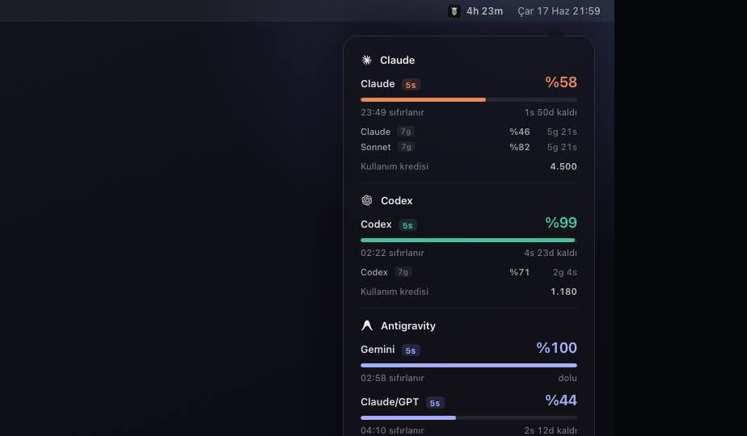

# Mimir Documentation

[🇹🇷 Türkçe](../tr/README.md) · 🇬🇧 English · [↑ Language selection](../README.md)

**Mimir** is a lightweight macOS menu bar app that shows real-time usage limits and reset countdowns for your AI tools — **Claude**, **Codex**, **Gemini** and **Antigravity** — without leaving your workflow.

Instead of running a terminal command and hitting your limit, you glance at the small indicator in the menu bar and instantly see how much you have left and when it resets.

## Table of contents

1. [Installation](installation.md)
2. [Reading the menu bar](menu-bar.md)
3. **Services**
   - [Claude](services/claude.md)
   - [Codex](services/codex.md)
   - [Antigravity](services/antigravity.md)
4. [Privacy & Security](privacy.md)

Also: [Support & FAQ](../../SUPPORT.md) · [Contributing](../../CONTRIBUTING.md) · [Changelog](../../CHANGELOG.md)

## Highlights

- **Menu bar at a glance** — every AI service's status in a single indicator and popover.
- **Live limits** — Claude session limits, Codex credits/quotas, and Antigravity group quotas, updated in real time.
- **Reset countdowns** — know exactly when each limit refreshes.
- **Colored status dots** — green / amber / red based on remaining quota.
- **Minimalist design** — monochrome icon, full macOS light/dark mode support.
- **Privacy-first** — reads only local app configs and the macOS Keychain; [no data ever leaves your machine](privacy.md).

## Supported services

| Service | Data source | Details |
|---|---|---|
| **Claude** | Claude Code OAuth (`~/.claude`) | [Claude →](services/claude.md) |
| **Codex** | ChatGPT usage API + local `~/.codex` JSONL fallback | [Codex →](services/codex.md) |
| **Antigravity** | Local language server + Cockpit account | [Antigravity →](services/antigravity.md) |

## How it works (short)

Mimir reads the **local data** your AI tools already create on your machine:

1. Reads the tool's config files (`~/.claude`, `~/.codex`, etc.) and macOS **Keychain** entries.
2. When possible, queries the service's **official usage API** (with the tool's own token).
3. Shows the result in the menu bar and refreshes it **every minute** automatically.

When a live source is temporarily unavailable (e.g. the Antigravity IDE is closed), Mimir shows the **last-known snapshot** instead of dropping the service entirely.

## Requirements

- **macOS 14.0 (Sonoma)** or later
- **Swift 6.0+** to build from source

---

Ready? Continue with **[Installation](installation.md)**.
